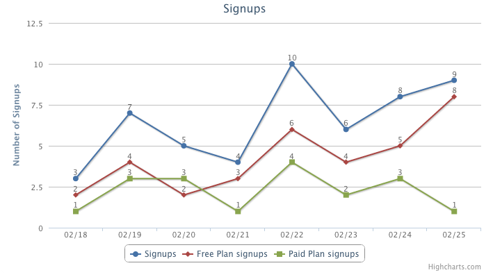

There are lot of  analytics tools out there which you can integrate with your application and get stats you need, but they do not always provide full control over the information, plus you always have to go back to there site to get the information. 

GetStats is a simple way to measure key metrics in your Rails app.

[https://github.com/megharastogi/get_stats](https://github.com/megharastogi/get_stats)

If you have any questions or feedback, please reach out to me on [Twitter](https://twitter.com/megharastogi).

Installation
------------

- Add `'get_stats', '~> 0.0.1'` to your Gemfile.
- Run `bundle install`.
- rails generate get_stats
- rake db:migrate
- Restart your server 


This will create a stats table in your database to store all the information.

GetStats Usage
----------------

To track a metric, all you need to add to your code is:

```
Stats.increment('stats_name')
```
Where 'stats_name' is the name you want to assign to the metric (ex: 'signup','liked_page')

Usage Examples
--------------

If you want to track number of signups everyday, you can add a call to Stats in 'after_create' to log the amount of signups every day.

```
class User < ActiveRecord::Base
   def after_create
      Stats.increment('signup')
   end
end
```
If the stat 'signup' does not exists it will create one, otherwise it will just increment the existing stat for the current day.

To track number of succesfull payments made everyday you can do something like

```
class Payment < ActiveRecord::Base
   def after_create
      if status == 'Success'
        Stats.increment('successful_payment')
      else
        Stats.increment('failed_payment_attempt')
      end 
   end
end
```

Optionally, you can pass a date parameter to the 'increment' method to store the stat for a given date.

For example, if want to track how many users signed up on each day, you can add something like this to a rake task:

```
  @users.each do |u|
      Stats.increment('signup', u.created_at)
  end    
```

```
  @payments.each do |p|
      if p.status == 'Success'
        Stats.increment('successful_payment',p.created_at)
      else
        Stats.increment('failed_payment_attempt',p.created_at)
      end
  end    
```

Retreiving Stats
----------------

Now that you have stored all the information, you just need to call Stats.show(stat_name)

```
  Stats.show('signup')
  Stats.show('successful_payment')
```
By default, it will output the data collected over last 7 days, but you can also pass options for viewing data for the trailing month, or a particular time range.

```
  Stats.show(stat_name,'week') // get trailing 7 days - default
  Stats.show(stat_name,'month') // get trailing 30 days
  Stats.show(stat_name,'time_range', start_date, end_date) // custom date range

```
```
  Stats.show('signup','week')
  Stats.show('signup','month')
  Stats.show('signup','time_range', Date.today - 15.days, Date.today)

```

Stats.show returns an array of data with count everyday

```
Stats.show('signup','week') 
["signup", Sat, 16 Feb 2013, 0], ["signup", Sun, 17 Feb 2013, 2], ["signup", Mon, 18 Feb 2013, 4], ["signup", Tue, 19 Feb 2013, 5], ["signup", Wed, 20 Feb 2013, 0], ["signup", Thu, 21 Feb 2013, 0]]
```
To view list of all the stat_names stored in the system you can call

```
Stats.show_all_stat_names  
```
Which will return an array of all the stat_names stored in the system

Displaying Graphs
-----------------
For displaying beautiful graphs, the gem uses [highcharts.js](http://www.highcharts.com/).

To add graphs to views, include highcharts.js (already added in the assets) and then use the partial 'display_graph'. Example below:

```
<%= javascript_include_tag :highcharts %>

<% @signups = Stats.show('signup','week') %>
<%= render :partial => "./display_graph", :locals => {:stats => @signups,:graph_type => "line"}%>
```


If you want to display more than metric in a graph you can pass an array of different metrics to stats variable for example:

```
<%= javascript_include_tag :highcharts %>

<% @signups = Stats.show('signup','week') %>
<% @free_plan = Stats.show('Free Plan signups','week') %>
<% @paid_plan = Stats.show('Paid Plan signups','week') %>

<%= render :partial => "./display_graph", :locals => {:stats => [@signups,@free_plan,@paid_plan],:graph_type => "line",:multiple => "true"}%>
```



Supported options for graph_type:
- 'line'
- 'area'
- 'bar'
- 'column'

More options are under development!

Feedback
--------
[Source code available on Github](https://github.com/megharastogi/get_stats). Feedback would be greatly appreciated (this is my first Gem!)


